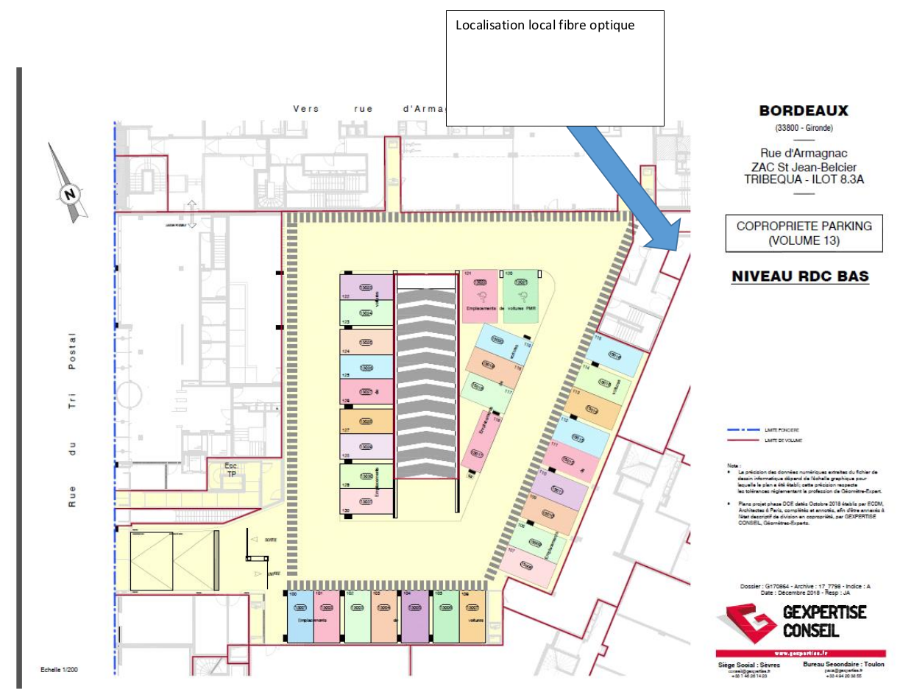
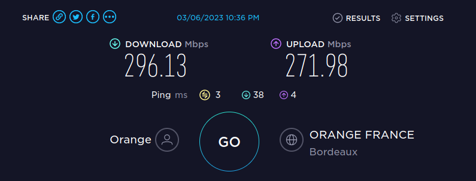

## Les ascenseurs

Ils tombent toujours en panne au mauvais moment. Pour signaler un problème, contactez OTIS au 0800242407

* L2 = SL9B1 [Voir l’état et signaler un problème pour l’ascenseur L2](https://www.eotisline.fr/home?elevatorRef=SL9B1)
* L4 = SL9B2 [Voir l’état et signaler un problème pour l’ascenseur L4](https://www.eotisline.fr/home?elevatorRef=SL9B2)

## Qu’ai-je le droit de faire/pas faire dans la résidence? Quel est le règlement de copropriété?

[Accédez au règlement de copropriété](/assets/pdf/RCP.pdf)

## Comment installer Internet?

Comment souscrire un abonnement Internet à Tribequa: L’immeuble est fibré par Orange. Au 12/09/2023 seul Orange, Sosh et Bouygues Telecom proposent une offre fibre. Théoriquement, les autres opérateurs pourront proposer des offres fibre dans le futur. Tous les appartements disposent d’un boitier fibre, mais la référence de la ligne (FT-XXXX-XXXX) n’est pas connue avant la première installation qui nécessite l’intervention d’un technicien.

1. rendez-vous sur le site d’Orange, Sosh ou Boouygues
2. renseigner 32 ou 33 places d’armagnac 33800 Bordeaux
3. Indiquez que vous n’avez pas de boitier fibre et demander un rendez-vous avec un technicien
4. Vous allez recevoir votre livebox et prendre RDV avec un technicien. S’il vous contacte pour pourrez lui expliquer que la prise est déjà présente dans l’appartement et qu’il n’y aura que besoin de raccorder au local “Operateur FT” dont il doit avoir la clef (voir plan ci-joint)
5. Lors du rendez-vous, demandez au technicien la référence de votre ligne (FT-XXXX-XXXX) afin de permettre une portabilité (changement d’opérateur) plus facile dans l’avenir. Notez la sur le boitier fibre dans votre appartement.
6. La box se place dans l’armoire électrique, et peut fournir du Wifi à tout l’appartement ou être reliée par des câbles Ethernet RJ-45 aux différentes prises présentes dans les pièces.
7. Il n’y a pas de règle connue pour la numérotation des prises dans le boitier électrique, il faut toutes les essayer pour savoir…
8. Les débits sont au moins de 300 Mbps réel chez Sosh

## Quelles performances pour la connexion à internet?

L’immeuble est fribré par Orange et les performances suivantes peuvent être atteintes en utilisant la connexion internet en RJ-45 (prises ethernet) dans les appartements:

## Comment fonctionnent les appareils livrés dans les appartements?

* [detecteur_fumée.pdf - 106.5 kB](assets/pdf/detecteur_fumée.pdf)
* [module_thermique.pdf - 1.1 MB](assets/pdf/module_thermique.pdf)
* [thermostats.pdf - 2.7 MB](assets/pdf/thermostats.pdf)
* [visiophone.pdf - 3.0 MB](assets/pdf/visiophone.pdf)
* [vmc.pdf - 243.8 kB](assets/pdf/vmc.pdf)
* [volets_roulants.pdf - 6.2 MB](assets/pdf/volets_roulants.pdf)

## Comment se tenir au courant des actualités par email?

Nous mettons en places plusieurs listes de diffusions pour les différentes parties-prenantes de la résidance.

### Contacter le conseil syndical

Le conseil syndical peut être contacté par mail à (cs chez listes point tribequa point org)

### Copropriétaires

La liste est destinée à ceux qui possèdent un bien dans la résidance: <https://listes.tribequa.org/wws//subscribe/copro>

* préparation de l’AG de copropriété
* comptes rendu des conseils syndicaux
* questions sur les charges, le syndic, l’AFUL, les travaux

### Résidants (tous)

La liste est destinée à ceux qui habitent effectivement la résidance : <https://listes.tribequa.org/wws//subscribe/residants>

* coups de main entre voisins
* questions de voisinage

### Listes par bâtiments

* Résidants du bâtiment L2: <https://listes.tribequa.org/wws//subscribe/residantsl2>
* Résidants du bâtiment L4: <https://listes.tribequa.org/wws//subscribe/residantsl4>

## Comment utiliser le groupe Whatsapp ?

* Charte d'utilisation du groupe WhatsApp [PDF](assets/pdf/charte.pdf)