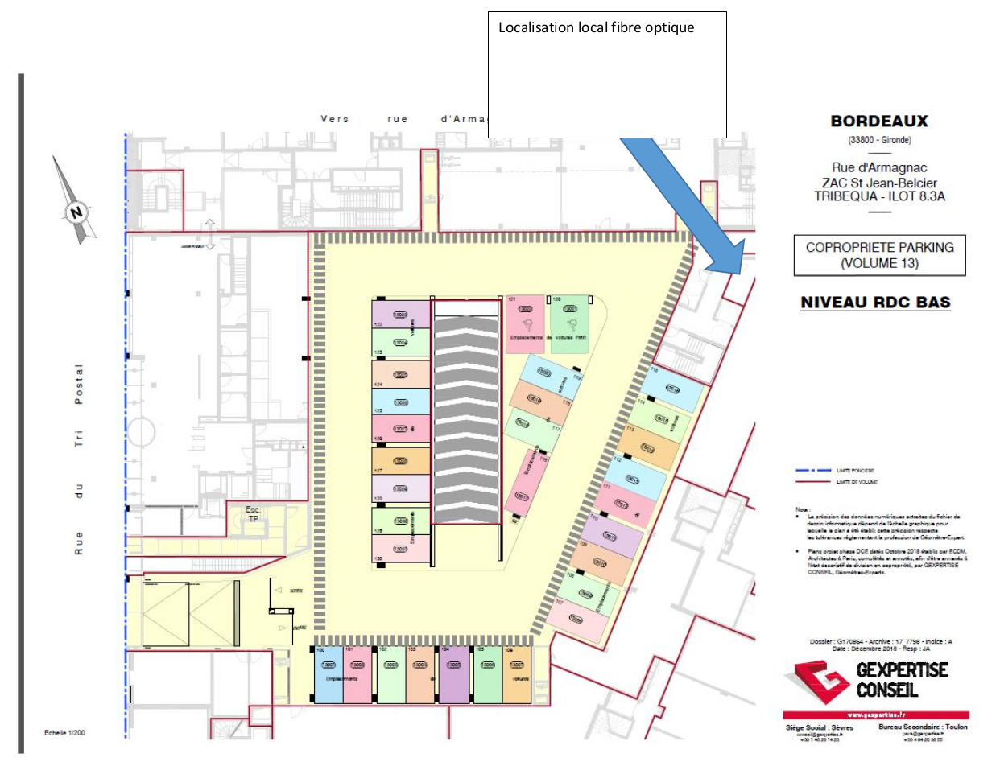

# Qui contacter pour obtenir de l'aide?

- Chez vous (parties privatives): propriétaire/bailleur
- Pas chez vous (parties communes/PK/fluides): Conseil syndical via whatsapp ou mail
- Coup de main/demande d'aide/voisinage: groupe whatsapp
- Un problème avec un voisin? : contacter le voisin en premier, puis passer par le conseil syndical par mail
- En général seuls les copropriétaires contactent le syndic, sauf pour les suivis de problèmes des les parties communes.

# Les Projets en cours
Les projets en cours sont financés exclusivement par les propriétaires pour améliorer le cadre de vie de tous.
- Installation des **caméras** de vidéosurveillance (2 par hall + 2 dans le local vélo) : fin 2025
- Rénovation des halls et installation de protections anti-chocs : après l'installation des caméras

---

# Le ménage
- **Hall/ascenseur** : 2 fois par semaine
- **Aspiration des moquettes** : 1 fois par semaine
- **Shampoouinage des moquettes** : 4 fois par an

- **Local poubelle** :
  - Sortie des bacs noirs : dimanche et jeudi soirs
  - Rentrée des bacs noirs : lundi et vendredi matins
  - Sortie des bacs verts : lundi soir
  - Rentrée des bacs verts : mardi matin
- **Local vélo** : nettoyé 4 fois par an

---

# Les encombrants
Les encombrants (meubles, cartons, effets divers) **ne doivent pas** être stockés dans les parties communes (couloirs, locaux poussettes, local poubelle). Ils doivent être déposés sur le trottoir **après avoir pris rendez-vous** avec Allo-Mairie Proximité au **05 56 10 33 33**.

Si les encombrants sont laissés dans les parties communes, l’entreprise de nettoyage procédera à leur enlèvement **à vos frais** (90 €/m³, ce qui augmentera les charges).

La déchetterie **Carles Vernet** est à votre disposition à proximité (300 m) et vous accueille **les week-ends**. Elle accepte les déchets suivants :
- Tout-venant incinérable
- Carton
- Métaux
- Déchets d’éléments d’ameublement
- Déchets d’équipements électriques et électroniques
- Écrans/téléviseurs

---

# Les ascenseurs
Ils tombent toujours en panne au mauvais moment. Pour signaler un problème, contactez **OTIS** au **0800 242 407**.
- **L2** = SL9B1 → [Voir l’état et signaler un problème pour l’ascenseur L2](https://www.eotisline.fr/home?elevatorRef=SL9B1)
- **L4** = SL9B2 → [Voir l’état et signaler un problème pour l’ascenseur L4](https://www.eotisline.fr/home?elevatorRef=SL9B2)

---

# Qu’ai-je le droit de faire/pas faire dans la résidence ? Quel est le règlement de copropriété ?
[Accédez au règlement de copropriété](/assets/pdf/RCP.pdf)

---

# Comment installer Internet ?
### Comment souscrire un abonnement Internet à Tribequa ?
L’immeuble est **fibré par Orange**. Au **12/09/2023**, seuls **Orange, Sosh et Bouygues Telecom** proposaient une offre fibre. Théoriquement, d’autres opérateurs pourront proposer des offres fibre à l’avenir.

Tous les appartements disposent d’un boîtier fibre, mais la référence de la ligne (**FT-XXXX-XXXX**) n’est pas connue avant la première installation, qui nécessite l’intervention d’un technicien.

#### Étapes pour installer Internet :
1. Rendez-vous sur le site d’**Orange, Sosh ou Bouygues**.
2. Renseignez l’adresse : **32 ou 33 places d’Armagnac, 33800 Bordeaux**.
3. Indiquez que vous n’avez pas de boîtier fibre et demandez un rendez-vous avec un technicien.
4. Vous recevrez votre Livebox et prendrez rendez-vous avec un technicien. Si ce dernier vous contacte, précisez-lui que la prise est déjà présente dans l’appartement et qu’il n’aura besoin que de raccorder au local **« Opérateur FT »**, dont il doit avoir la clé (voir plan ci-joint).
5. Lors du rendez-vous, demandez au technicien la **référence de votre ligne (FT-XXXX-XXXX)** pour faciliter une éventuelle portabilité (changement d’opérateur) à l’avenir. Notez-la sur le boîtier fibre dans votre appartement.
6. La box se place dans l’armoire électrique et peut fournir du Wi-Fi à tout l’appartement ou être reliée par des câbles Ethernet RJ-45 aux différentes prises présentes dans les pièces.
7. Il n’y a pas de règle connue pour la numérotation des prises dans le boîtier électrique : il faut toutes les essayer pour savoir…
8. Les débits sont d’au moins **300 Mbps** en réel chez Sosh.

---

# Quelles performances pour la connexion Internet ?
L’immeuble est **fibré par Orange** et les performances suivantes peuvent être atteintes en utilisant la connexion Internet en **RJ-45 (prises Ethernet)** dans les appartements : **1 Gbps symétrique**.

---

# Comment fonctionnent les appareils livrés dans les appartements ?
- [Détecteur de fumée](assets/pdf/detecteur_fumée.pdf) (106.5 Ko)
- [Module thermique](assets/pdf/module_thermique.pdf) (1.1 Mo)
- [Thermostats](assets/pdf/thermostats.pdf) (2.7 Mo)
- [Visiophone](assets/pdf/visiophone.pdf) (3.0 Mo)
- [VMC](assets/pdf/vmc.pdf) (243.8 Ko)
- [Volets roulants](assets/pdf/volets_roulants.pdf) (6.2 Mo)

---

# Comment se tenir au courant des actualités par e-mail ?
Nous mettons en place plusieurs listes de diffusion pour les différentes parties prenantes de la résidence.

### Contacter le conseil syndical
Le conseil syndical peut être contacté par e-mail à : **cs@tribequa.org**

### Liste pour les copropriétaires
Cette liste est destinée à ceux qui possèdent un bien dans la résidence : **copro@tribequa.org**
- Préparation de l’AG de copropriété
- Comptes-rendus des conseils syndicaux
- Questions sur les charges, le syndic, l’AFUL, les travaux

**Pour vous inscrire** : envoyez un e-mail à **copro-subscribe@tribequa.org**

---

# Comment utiliser le groupe WhatsApp ?
- [Charte d’utilisation du groupe WhatsApp](assets/pdf/charte.pdf)
- Pour rejoindre le groupe WhatsApp, contactez un voisin, qui fera la demande pour vous ajouter au groupe.
